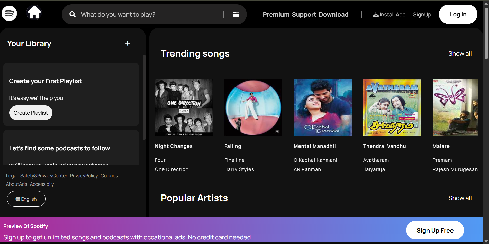
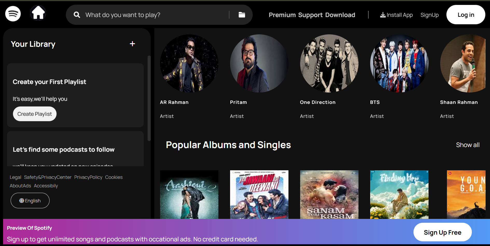
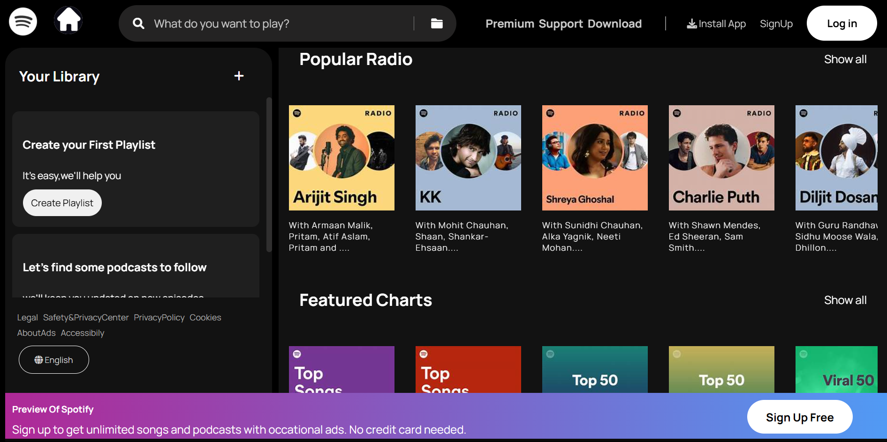
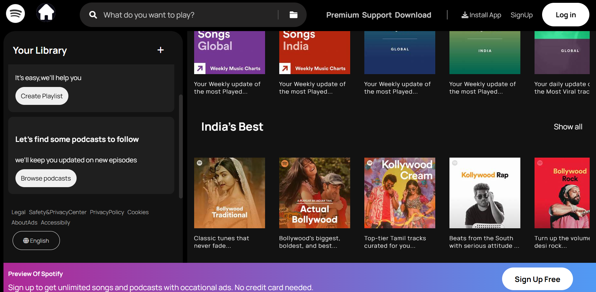
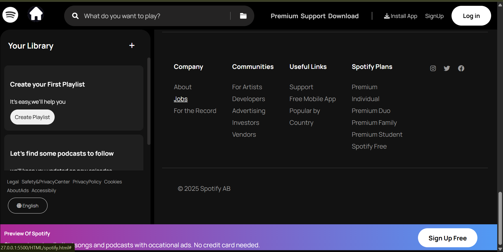

# spotify-homepage-layout-html-css
# 🎧 Music App UI – Inspired by Spotify
This is a front-end practice project built using **HTML** and **CSS**, inspired by the design of Spotify’s homepage.  
It was created as a personal exercise to improve my HTML structure and CSS layout skills.
---
## 🔧 Features

- 🎨 Static UI layout inspired by Spotify
- 🖼️ Desktop-first design (non-responsive)
- 🖱️ Basic styling and hover effects
- 🧱 Layout created using Flexbox
- 🧹 Clean and semantic HTML structure
- 🧾 Pure HTML and CSS – no frameworks or libraries used

---
## 🛠️ Tech Stack

- HTML5  
- CSS3
---

## 🧰 Tools Used

- Visual Studio Code (VS Code)
- Chrome DevTools (for layout verification and inspection)
---
## 📸 Preview

Below are snapshots of the static Spotify-inspired homepage:

### 🔹 Screenshot 1: Trending Songs Section

### 🔹 Screenshot 2: Popular Artists & Albums

### 🔹 Screenshot 3: Popular Radio and Charts

### 🔹 Screenshot 4: India's Best Section

### 🔹 Screenshot 5: Footer Section

---

## 🔗 Live Demo

[Click here to view the project live](https://s-d-13.github.io/spotify-homepage-layout-html-css/)

## 📚 What I Learned

- Structuring web page content using HTML  
- Styling components using pure CSS  
- Aligning elements using Flexbox  
- Improving visual design accuracy with Chrome DevTools
---
## 🚫 Disclaimer

This project is built **only for educational and learning purposes.**  
It is not affiliated with or endorsed by Spotify. All brand names and logos belong to their respective owners.

---

## 👩‍💻 Author

[@s-d-13](https://github.com/s-d-13)  
Aspiring Web Developer
